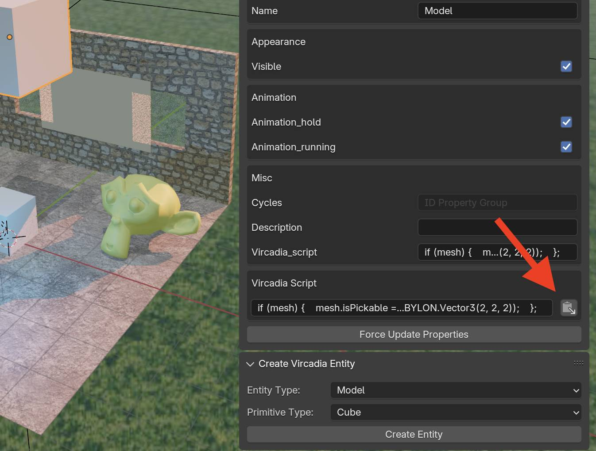

# Scripting

Scripts are created and executed in their intended environment, so scripts created under the `babylonjs` section will be executed in a Babylon.js environment, but nowhere else.

:::note

Currently we are only using the `vircadia_script` property and this only executes in Babylon.js. This is temporary and will be revised in a later release.

:::

## Scripting in Babylon.js

Babylon.js scripts are transpiled from TypeScript, you can make your script as simple or complex as you'd like and utilize any Web APIs that are available in normal conditions. 

However, we prefer to keep things simple and utilize Babylon.js' native functionality such as the [Action Manager](https://doc.babylonjs.com/features/featuresDeepDive/events/actions) to create functionality.

:::note

Currently, we create a scene action manager and an action manager for each mesh by default so you do not need to make one.

:::

### Adding a Script

To add a script, it must be stringified into one line due to limitations within Blender, this is done automatically for you if you copy the script to your clipboard and click the paste button next to the script field.



### Examples

#### Simple

```typescript
// Make sure the mesh is pickable
mesh.isPickable = true;

// Register an action to change color on click
mesh.actionManager.registerAction(
    new BABYLON.ExecuteCodeAction(
        BABYLON.ActionManager.OnPickTrigger,
        function() {
            // Change the mesh color to a random color
            mesh.material = new BABYLON.StandardMaterial("randomMaterial", scene);
            mesh.material.diffuseColor = BABYLON.Color3.Random();
            console.log('Mesh clicked, color changed');
        }
    )
);
```

#### Complex

```typescript
// Make sure the mesh is pickable
mesh.isPickable = true;
mesh.isVisible = true;
mesh.isNearGrabbable = true;
// Variable to track if we're scaling up or down
let isScalingUp = false;

// Function to clamp scaling between 0.5 and 2
const clampScaling = (scaling) => {
    return BABYLON.Vector3.Clamp(scaling, new BABYLON.Vector3(0.5, 0.5, 0.5), new BABYLON.Vector3(2, 2, 2));
};

// Action for mouse enter - start scaling up
const actionStartScaling = mesh.actionManager.registerAction(
    new BABYLON.ExecuteCodeAction(
        BABYLON.ActionManager.OnPointerOverTrigger,
        function() {
            isScalingUp = true;
            console.log('Mouse entered, scaling up');
        }
    )
);

// Action for mouse leave - start scaling down
const actionStopScaling = mesh.actionManager.registerAction(
    new BABYLON.ExecuteCodeAction(
        BABYLON.ActionManager.OnPointerOutTrigger,
        function() {
            isScalingUp = false;
            console.log('Mouse left, scaling down');
        }
    )
);

// Action to perform the actual scaling on every frame
const actionScale = scene.actionManager.registerAction(
    new BABYLON.ExecuteCodeAction(
        BABYLON.ActionManager.OnEveryFrameTrigger,
        function() {
            if (isScalingUp) {
                mesh.scaling.scaleInPlace(1.01); // Increase scale by 1%
            } else {
                mesh.scaling.scaleInPlace(0.99); // Decrease scale by 1%
            }

            // Clamp the scaling between 0.5 and 2
            mesh.scaling = clampScaling(mesh.scaling);
        }
    )
);
```
